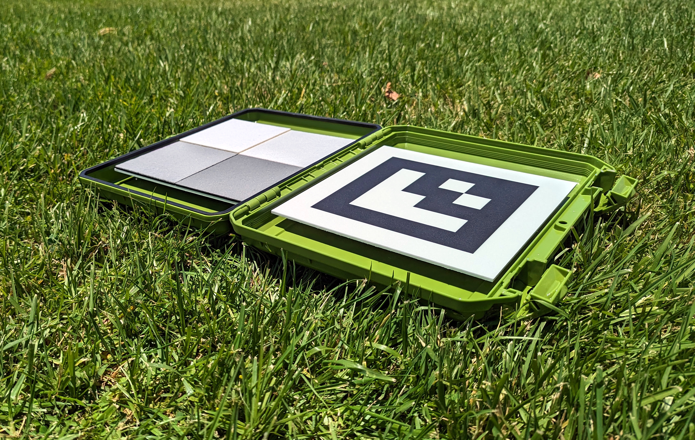

# Kalibrointikohteet

MAPIR tarjoaa erilaisia kalibrointikohteita monenlaisiin käyttötarkoituksiin. Alla näkyvä kompakti T4-R50-malli sisältää neljä paneelia, joiden valonheijastavuus on mitattu aallonpituusalueella 250–2 500 nm.

<figure><figcaption>
MAPIR T4-R50
</figcaption></figure>T4-diffuusiovertailukohteilla on seuraavat heijastuskäyrät, [tiedot ladattavissa täältä](https://cdn.shopify.com/s/files/1/0972/5566/files/MAPIR_Diffuse_Reflectance_Standard_Calibration_Target_Data_T4.xlsx?v=1741759157):

<figure><figcaption>
MAPIR T4-heijastavuus :: 250–2 500 nm
</figcaption></figure>

<figure><figcaption>
MAPIR T4-heijastavuus :: 400–1 000 nm
</figcaption></figure>T4P-diffuusi-vertailukohteilla on seuraavat heijastuskäyrät, [tiedot ladattavissa täältä](https://cdn.shopify.com/s/files/1/0972/5566/files/MAPIR_Diffuse_Reflectance_Standard_Calibration_Target_Data_T4.xlsx?v=1741759157):

<figure><figcaption>
MAPIR T4P-heijastavuus :: 250–2500 nm
</figcaption></figure>

<figure><figcaption>
MAPIR T4P-heijastavuus :: 400–1000 nm
</figcaption></figure>Heijastavuuskaaviosta näet, että arvot ovat aallonpituus (x-akseli) suhteessa heijastavuusprosenttiin (y-akseli). Kun otamme kuvan kalibrointikohteesta, luomme suhteen pikseliarvon ja heijastavuusprosentin välille spektrissä, johon kunkin kameran anturikaistan herkkyys ulottuu.

Tämä tarkoittaa, että jokaisen kamerallamme ottamasi kuvan kanssa voit käyttää valokuvia heijastavuuskohteistamme, kuten [T4-R50](https://www.mapir.camera/collections/calibration-targets/products/diffuse-reflectance-standard-calibration-target-package-t3-r50) tai [T4-R125](https://www.mapir.camera/collections/multispectral-reflectance-reference-calibration-targets/products/diffuse-reflectance-standard-calibration-target-package-t4-r125), kalibroimaan kuvien heijastavuuden. Kalibroinnin jälkeen kuvan jokainen pikseli vastaa heijastavuusprosenttia.

Jos tulostat kalibroidut kuvat Chloros:ssä tavallisena JPG- tai TIFF-tiedostona, heijastusprosentti lasketaan jakamalla pikseliarvo kuvamuodon bittisyvyydellä. JPG-tiedostossa jaetaan siis 255:llä ja TIFF:ssä 65 535:llä. Voit myös valita PERCENT-tiedostomuodon tulostuksen Chloros:ssa, jolloin kunkin pikselin arvo vaihtelee välillä 0,0–1,0 (0–100 % heijastavuus). Muista kuitenkin, että jotkin kuvankäsittelyohjelmat eivät tue prosenttiarvoisia (liukuluku) kuvia, ja ne vievät paljon tallennustilaa.

<figure><figcaption>
T4-R125
</figcaption></figure> <figure><figcaption>
T4-R125
</figcaption></figure> <figure><figcaption>
T4-R125
</figcaption></figure>

