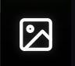

# Indeksi/LUT-kokeilualusta

Indeksi/LUT-kokeilualusta on Chloros-kuvankatseluohjelman sisällä toimiva interaktiivinen työtila, jonka avulla voit kokeilla monispektristen indeksien laskemista ja värillisiä visualisointeja reaaliajassa. Tämän tehokkaan työkalun avulla voit testata erilaisia indeksejä, tarkentaa arvoalueita ja luoda julkaisukelpoisia visualisointeja ilman, että koko aineistoa tarvitsee käsitellä uudelleen.

## Mikä on indeksi/LUT-hiekkalaatikko?

### Tarkoitus

Hiekkalaatikko tarjoaa:

* **Reaaliaikaisen indeksin laskennan** – Sovella mitä tahansa kasvillisuusindeksiä välittömästi
* **Interaktiivisen LUT-säätämisen** – Hienosäädä värigradientteja ja alueita
* **Työnkulun optimoinnin** – Määritä parhaat asetukset ennen eräkäsittelyä

### Sandbox vs. projektikäsittely

**Indeksi/LUT-Sandbox (interaktiivinen):**

* Yksi kuva kerrallaan
* Välitön palaute
* Kokeellinen ja iteratiivinen
* Ei pysyviä muutoksia tiedostoihin
* Täydellinen tutkimiseen ja testaamiseen

**Projektikäsittely (erä):**

* Koko tietojoukko kerralla
* Ennalta määritetyt asetukset
* Pysyvät tulostustiedostot
* Aikaa vievää
* Paras vaihtoehto, kun asetukset on vahvistettu


**Paras työnkulku**: Käytä Sandboxia kokeilemiseen ja optimaalisten indeksi- ja LUT-asetusten löytämiseen, ja sovella sitten näitä asetuksia koko tietojoukkoon projektikäsittelyn aikana.


***

## Indeksi-/LUT-Sandboxin käyttö

### Ennalta laskettujen indeksien ymmärtäminen

Chloros:ssa indeksejä voidaan soveltaa projektin käsittelyn aikana. Vientiin sovellettavien indeksi- ja LUT-asetusten määrittämiseksi on helpointa käyttää kuvankatseluohjelman Sandboxia.

Sandboxin avulla voit:

* **Käyttää uusia indeksejä ja värigradientteja (LUT-taulukoita)** datan visualisointiin
* **Säätää visualisointiasetuksia** interaktiivisesti
* **Tarkastella** jo laskettuja indeksikuvia
* **Tarkistaa** pikseliarvoja kaikilla zoomausasteilla

### Sandboxin avaaminen

Indeksi-/LUT-sandboxiin pääsee **Kuvankatseluohjelman**  -sivupalkin välilehdestä:

1. Napsauta kuvaa tiedostoselaimen kuvaruudukossa, jolloin se avautuu **Kuvankatseluohjelman**  -välilehdessä
2. Napsauta **Image Viewer**  -välilehteä avataksesi vasemman ponnahdusvalikon, jos se ei ole jo auki

### Indeksin/LUT:n kohdistettavan kuvan valitseminen

Työskennelläksesi indeksin kanssa Image Viewer  -hiekkalaatikossa:

1. **Avaa kuva** pääkuvaruudukosta napsauttamalla sitä
2. **Kuvankatseluohjelman**  -välilehti avautuu
3. Napsauta **Layer-pudotusvalikkoa** (katselijan oikeassa yläkulmassa)
4. Valitse kerros pudotusvalikosta:
   * RAW (Reflectance)

### Indeksin soveltaminen kuvaan

Kun kuva on koko ruudun kokoinen ja **Image Viewer**  -välilehden sivupalkki on auki:

1. Valitse Indeksi-ruutu sivupalkin yläosasta
2. Valitse kamerasi suodatin vasemmasta pudotusvalikosta
3. Valitse haluamasi indeksikaava oikeasta pudotusvalikosta
4. Vedä suodattimen kanavan väripiirejä alla olevan indeksikaavan kohdille
5. Kun kaava on kelvollinen, kuva päivittyy ja näyttää indeksiarvot
6. Liikuta hiiren osoitinta nähdäksesi arvot osoittimen sijainnissa
7. Zoomaa nähdäksesi yksittäiset pikselit ja niihin liittyvät arvot

Jokaisella indeksillä on tietty arvoalue ja merkitys:

#### NDVI Esimerkki

```

Formula: (NIR - Red) / (NIR + Red)

For Survey3W RGN camera:
NIR = 850nm band
Red = 661nm band

Result range: -1.0 to +1.0
Typical vegetation: 0.4 to 0.9
Stressed vegetation: 0.2 to 0.4
Bare soil: 0.0 to 0.2
Water: -0.1 to 0.1
```

Täydellinen indeksikaavojen dokumentaatio löytyy kohdasta [Monispektriset indeksikaavat](../project-settings/multispectral-index-formulas.md).

***

## LUT-taulukoiden (Look-Up Tables) käyttö

### Mikä on LUT?

**Look-Up Table (LUT)** muuntaa numeeriset indeksiarvot väreiksi visualisointia varten:

* **Syöte**: Indeksin pikseliarvo (esim. NDVI 0,65)
* **Tulos**: RGB väri (esim. kirkkaanvihreä)
* **Tarkoitus**: Helpottaa kuvioiden havaitsemista ja tulkintaa**Harmaasävy vs. väri-LUT:**

* Harmaasävy: Tieteellinen ja neutraali, näyttää raakadataa
* Väri-LUT: Intuitiivinen ja vaikuttava, korostaa kuvioita ja eroja


**Visualisointiteho**: Värillisen LUT:n soveltaminen harmaasävyiseen indeksikuvaan helpottaa huomattavasti kuvioiden, poikkeamien ja kiinnostavien alueiden tunnistamista yhdellä silmäyksellä.


### LUT:n soveltaminen indeksikuvaan

Kun sinulla on indeksikuva, joka näyttää

1. Napsauta  &quot;+Lisää LUT&quot; -painiketta
2. Valitse värigradientti
3. Säädä leikkauksen minimi- ja maksimipisteitä
4. Säädä leikkausmoodia
5. Valitse **Kuvankatselijan**  -välilehden sivupalkissa LUT:n soveltamiseksi

### Värigradientin valitseminen

**Gradientin valitseminen:**

1. Etsi LUT-paneelista**värillinen gradienttipalkki**

2. Vie hiiri sen päälle nähdäksesi käytettävissä olevat gradienttiasetukset
3. Valitse haluamasi gradientti
4. Kuva **päivittyy välittömästi** uusilla väreillä, kun Indeksi-ruutu on valittuna


**Paras käytäntö**: Kasvillisuusindeksien, kuten NDVI, kohdalla Red-keltainen-Green-gradientti on intuitiivisin, koska se vastaa luonnollisia väriyhdistelmiä (vihreä = terve, keltainen = kohtalainen, punainen = stressaantunut).


### Väriluokkien säätäminen

**Luokat-säädin**määrittää, kuinka monta erillistä värivaihetta gradientissa näkyy:**Luokkien lukumäärän vaihtoehdot:*** **2–5 luokkaa**: Erittäin laajat kategoriat, erilliset vyöhykkeet
* **6–10 luokkaa**: Tasapainoinen, sopii luokitteluun
* **11–20 luokkaa**: Tasaiset gradientit, jatkuva ulkonäkö
* **20+ luokkaa**: Lähes jatkuva, maksimaalinen tasaisuus**Kuinka säätää:**

1. Etsi LUT-paneelista**värinäytteiden neliöt gradienttipalkin alapuolelta**

2. Säädä luokkien määrää lisäämällä niitä +-painikkeella
3. Poista luokkia kaksoisnapsauttamalla värinäytettä
4. Gradientti päivittyy **reaaliajassa** kuvaan**Vaikutus visualisointiin:*** **Vähemmän luokkia** (3–5): Luo erillisiä alueita, yksinkertaistettu luokittelu, helpompi erottaa kategoriat
* **Keskimääräinen määrä luokkia** (6–10): Tasapainoinen lähestymistapa, sopii useimpiin sovelluksiin
* **Enemmän luokkia** (15–20): Tasaiset siirtymät, yksityiskohtaiset vaihtelut, valokuvamainen ulkonäkö**Käyttötarkoitukset:*** **Vähän luokkia (3–5)**: Esitysslidit, luokittelukartat, yksinkertaiset raportit
* **Keskimääräinen määrä luokkia (6–10)**: Yleinen analyysi, tasapainoinen yksityiskohtaisuus, vakiomuotoiset raportit
* **Paljon luokkia (15–20)**: Tieteellinen analyysi, yksityiskohtainen tarkastelu, julkaisukelpoiset tulokset

### Arvoalueiden hienosäätö

**Arvoalueiden säätimet**määrittävät, mitkä indeksiarvot vastaavat mitäkin värejä gradientissasi:**Arvoalueiden säätimet LUT-paneelissa:*** **Minimiarvo**: Väriskaalan alaraja
* **Maksimiarvo**: Väriskaalan yläraja
* **Välivärit**: Jaetaan automaattisesti minimi- ja maksimiarvojen välille (luokkien lukumäärän perusteella)

#### Minimi- ja maksimiarvojen säätäminen

**Arvoalueiden säätäminen:**

1. Etsi LUT-paneelista**Minimiarvo**- ja**Maksimiarvo**-syöttökentät
2. Napsauta **Minimiarvo**-kenttää
3. Kirjoita haluttu minimiarvo (esim. `0.2`)
4. Paina **Enter**-näppäintä tai napsauta kentän ulkopuolelle
5. Toista sama **Max Value** -kentän kohdalla (esim. `0.9`)
6. Visualisointi **päivittyy välittömästi****Automaattinen skaalaus**: Kun sovellat LUT:ta ensimmäisen kerran, Chloros asettaa automaattisesti minimi- ja maksimiarvot kuvan todellisen data-alueen mukaan. Voit sitten kaventaa tätä aluetta keskittyäksesi tiettyihin kiinnostaviin arvoalueisiin.


**Esimerkki NDVI-alueen säätöistä:*** **Koko alue**: `-1.0` – `1.0` (näytä kaikki mahdolliset arvot)
* **Kasvillisuuteen keskittynyt**: `0.2` – `0.9` (poista paljas maa ja vesi)
* **Vain terve kasvillisuus**: `0.5` – `0.9` (korosta vain voimakkaasti kasvavat kasvit)
* **Stressin havaitseminen**: `0.2` – `0.5` (korosta ongelma-alueet)
* **Mukautettu alue**: Säädä havaittujen pikseliarvojen perusteella**Miksi alueita tulisi säätää?*** **Lisää kontrastia** kiinnostavalla alueella
* **Poista epäolennaiset arvot** (esim. vesistöt, paljas maaperä)
* **Yhdenmukaista visualisointi** useiden kuvien tai päivämäärien välillä
* **Korosta hienovaraisia eroja** kapealla arvoalueella

### Alueen ulkopuolisten arvojen leikkaaminen

Kun pikseliarvot eivät mahdu määrittelemääsi minimi-/maksimiarvoalueeseen, voit hallita niiden näyttöä **leikkausmoodien** avulla.

#### **Käytettävissä olevat leikkausmoodivaihtoehdot:**

#### 1. Minimi ja maksimi

* Pikselit, jotka ovat **minimiarvon alapuolella**→ näytetään käyttämällä gradientin**ensimmäistä väriä** (esim. punainen)
* Pikselit, jotka ovat **maksimiarvon yläpuolella**→ näytetään käyttämällä gradientin**viimeistä väriä** (esim. vihreä)
* **Käyttötapaus**: Korosta ääriarvot, näytä koko data-alue kylläisillä väreillä rajoilla
* **Esimerkki**: NDVI-arvot alle 0,2 näkyvät kaikki punaisina, arvot yli 0,9 näkyvät kaikki vihreinä

#### 2. Läpinäkyvä tausta

* **Alueen ulkopuolella**olevat pikselit muuttuvat**täysin läpinäkyviksi*** Vain **alueen sisällä** olevat pikselit näyttävät värigradientin
* **Käyttötapaus**: GIS-peittokuva, tiettyjen arvoalueiden erottelu, vain kiinnostavien alueiden korostaminen
* **Esimerkki**: Näytä vain NDVI 0,4–0,7 värillisenä, kaikki muu läpinäkyvänä


**Läpinäkyvyyden rajoitus**: Läpinäkyvät pikselit näkyvät katseluohjelmassa taustavärinä. Kun tiedosto viedään käsittelyn aikana, läpinäkyvyys säilyy PNG-muodossa, mutta ei JPG-muodossa.


#### 3. Indeksin tausta

* **Alueen ulkopuolella**olevat pikselit näkyvät**harmaasävyinä** (raakaindeksiarvot näkyvät)
* **Alueen sisällä**olevat pikselit näyttävät**värigradientin*** **Käyttötapaus**: Hienovarainen korostus, kontekstin säilyttäminen samalla kun korostetaan kiinnostavia alueita
* **Esimerkki**: Korosta värillä stressaantunutta kasvillisuutta (NDVI 0,3–0,5) ja näytä terveet alueet harmaana

#### 4. Alkuperäinen tausta

* **Alueen ulkopuolella**olevat pikselit näyttävät**alkuperäisen monispektrikuvan*** **Alueen sisällä**olevat pikselit näyttävät**värigradientin*** **Käyttötapaus**: Intuitiivisin – yhdistää luonnollisen kuvakontekstin analyyttiseen väripäällysteeseen
* **Esimerkki**: Katso kentän/viljelykasvien todellinen ulkonäkö, johon on päällekkäin värikoodatut stressialueet

### Oikean leikkausmoodin valinta

| Leikkaustila              | Sopii parhaiten                                   | Visualisointityyli          |
| -------------------------- | ------------------------------------------ | ---------------------------- |
| **Minimi ja maksimi**    | Täydellinen datanäyttö, tieteellinen analyysi     | Kaikki pikselit värillisiä           |
| **Läpinäkyvä tausta** | GIS-peittokuvat, tiettyjen alueiden erottelu    | Väri alueella, tyhjä sen ulkopuolella |
| **Indeksitausta**       | Hienovarainen korostus, datakontekstin säilyttäminen  | Väri alueella, harmaa sen ulkopuolella  |
| **Alkuperäinen tausta**    | Raportit, esitykset, intuitiivinen analyysi | Väri alueella, valokuva sen ulkopuolella |

### Mukautettujen LUT-värien luominen

Voit hallita visualisointia täysin luomalla **mukautettuja värigradientteja** muokkaamalla yksittäisiä väripysähdyksiä.**Mukautetun gradientin luominen:**

1. Etsi LUT-paneelista**gradientin esikatselupalkki**

2. Etsi gradientin alapuolelta**värinäytteiden neliöt**

3.**Napsauta väripysähdystä** valitaksesi sen
4. **Värivalitsin** avautuu
5. Valitse uusi väri käyttämällä:
   * **Värirengasta**: Visuaalinen värivalinta
   * **RGB/HSV-liukusäätimiä**: Tarkka värinhallinta
   * **Hex-koodin syöttöä**: Tarkka värimäärittely (esim. `#FF0000` punaiselle)
6. Napsauta värivalitsimen ulkopuolelle **sovellaksesi uuden värin**

7. Liukuväri**päivittyy välittömästi** kuvassa**Väripysähdysten lisääminen tai poistaminen:*** **Lisää pysähdys**: Napsauta +-kuvaketta lisätäksesi uuden värinäytteen loppuun
* **Poista pysähdys**: Kaksoisnapsauta väriruutua poistaaksesi värinäytteen**Mukautusstrategiat:*** **Käännä gradientti**: Käännä värien järjestys merkityksen kääntämiseksi (esim. vihreä = matala, punainen = korkea)
* **Brändivärit**: Sovita raportit organisaatiosi väripalettiin
* **Värisokeille sopiva**: Käytä oranssi-sinisiä tai violetti-keltaisia yhdistelmiä
* **Tulostuksen optimointi**: Valitse värit, jotka toimivat sekä väri- että harmaasävyisessä tulostuksessa
* **Monikynnys**: Käytä erillisiä värejä tietyissä arvorajoissa luokittelua varten


**Mukautettujen gradienttien tallentaminen**: Mukautetut gradientit voidaan tallentaa ja käyttää uudelleen. Napsauta LUT-paneelin tallennuskuvaketta tallentaaksesi mukautetut värimaailmat tulevaa käyttöä varten.


***

## Interaktiivinen työnkulku

### Reaaliaikaiset päivitykset

Kaikki LUT-säädöt hiekkalaatikossa päivittävät kuvan **välittömästi ja interaktiivisesti**:

* **Vaihda tasoa** → Kuva muuttuu välittömästi
* **Valitse gradientti** → Värit päivittyvät välittömästi
* **Säädä arvoaluetta** → Kontrasti muuttuu reaaliajassa
* **Vaihda luokkia** → Gradientin tasaisuus päivittyy välittömästi
* **Muokkaa leikkausta** → Taustan näyttö muuttuu välittömästi
* **Muokkaa värejä** → Mukautettu gradientti otetaan käyttöön välittömästi**&quot;Käytä&quot;-painiketta ei tarvita** – kaikki muutokset ovat reaaliaikaisia ja interaktiivisia!


**Reaaliaikainen palaute**: Välittömän visuaalisen palautteen ansiosta voit kokeilla nopeasti erilaisia asetuksia, kunnes löydät analyysitarpeisiisi sopivan optimaalisen visualisoinnin.


### Iteratiivinen hienosäätötyönkulku

**Tyypillinen LUT-optimointityönkulku:**

1.**Valitse indeksikerros** (esim. RAW (heijastavuus))
2. **Käytä indeksiä** – Valitse kamerasuodatin ja indeksikaava, vedä värilliset ympyrät oikeaan kohtaan indeksikaavassa
3. **Käytä LUT-gradienttia** – Aloita Red-Yellow-Green-esiasetuksella
4. **Tarkista pikseliarvot** – Liikuta kursoria ympäriinsä, huomioi arvoalueet
5. **Säädä minimi-/maksimiarvoja** – Rajaa alue kasvillisuuteen keskittymiseksi (esim. 0,2–0,9)
6. **Valitse leikkaus** - Kokeile &quot;Alkuperäinen tausta&quot; kontekstin vuoksi
7. **Tarkenna värejä** - Mukauta gradienttia tarvittaessa tiettyjen kohteiden korostamiseksi
8. **Viimeistele asetukset**- Kirjaa asetukset muistiin ja kopioi ne Projektin asetuksiin vientikäsittelyä varten

### Pikseliarvojen tarkastelu

Todellisten pikseliarvojen ymmärtäminen on ratkaisevan tärkeää tehokkaiden LUT-alueiden asettamiseksi:**Kuinka tarkastella arvoja:**

1. Pikseliarvot näkyvät, kun kuvassa on joko Indeksi-valintaruutu tai sekä Indeksi- että LUT-valintaruudut**valittuna**.
2. **Siirrä kursori** kuvan eri alueiden päälle
3. **Tarkkaile pikseliarvoja**, jotka näkyvät selitteessä, kun viet kursorin kuvan päälle
4. Zoomaa nähdäksesi yksittäiset pikselit, jotka on korostettu kelluvalla arvolla
5. **Tee muistiinpanoja** eri piirteiden arvoalueista:
   * **Terve kasvillisuus**: esim. NDVI 0,55–0,85
   * **Stressaantunut kasvillisuus**: esim. NDVI 0,30–0,50
   * **Paljas maaperä**: esim. NDVI 0,05–0,25
   * **Vesi** (jos läsnä): esim. NDVI -0,05–0,10**Pikseliarvojen käyttö LUT-alueiden asettamisessa:**Kun olet tarkastellut pikseliarvoja, säädä LUT:n minimi- ja maksimiarvot vastaavasti:**Esimerkki:*** **Havainto**: Maaperän arvot = 0,05–0,25, stressaantunut = 0,25–0,50, terve = 0,50–0,85
* **Tavoite**: Visualisoi vain kasvien terveys (jätä maaperä pois)
* **LUT-asetukset**: Min = `0.25`, Max = `0.85`
* **Leikkaus**: &quot;Alkuperäinen tausta&quot;, jotta maaperä näkyy luonnollisissa väreissä
* **Tulos**: Värigradientti koskee vain kasvillisuutta, maaperä näkyy alkuperäisen kuvan mukaisena


**Dynaaminen alue**: Eri viljelykasveilla, vuodenaikoilla ja kasvuvaiheilla on erilaiset arvoalueet. Tarkista aina pikseliarvot omassa tietojoukossasi ennen LUT-alueiden asettamista.


***

## Mukautetut indeksit (Chloros+)

### Mukautettujen indeksikaavojen luominen


**Missä luoda**: Mukautetut indeksit voidaan määrittää**Projektin asetuksissa** ennen käsittelyä sekä Image Viewer -sivupalkin hiekkalaatikossa.


**Mukautetun indeksin luominen:**

1.**Avaa Projektin asetukset** (ennen käsittelyä) tai Image Viewer -hiekkalaatikon sivupalkki
2. Siirry **Indeksikaavan pudotusvalikkoon**

3. Etsi**&quot;Mukautettu&quot;**-vaihtoehto (sinun on oltava kirjautuneena sisään Chloros+ -lisenssillä)
4. **Määritä kaava** käyttämällä kaistamuuttujia:
   * Kaistojen nimet: `NIR`, `Red`, `Green`, `Blue`, `RedEdge` jne.
   * Operaattorit: `+`, `-`, `*`, `/`, `^` (eksponentti)
   * Funktiot: `sqrt()`, `abs()` jne. (jos tuettu)
   * Suluissa: `()` laskujärjestyksen määrittämiseksi
5. **Nimeä indeksi** (esim. &quot;MyIndex&quot; tai &quot;CustomNDVI&quot;)
6. **Tallenna asetukset**

**Esimerkkejä mukautetuista kaavoista:**

```

Modified NDVI with offset:
(NIR - Red) / (NIR + Red + 0.5)

Simple ratio:
NIR / Red

Complex multi-band:
(NIR - Red) / (NIR + Red - Blue)

Exponential index:
(NIR / Red) ^ 2
```


**Kaavan vahvistus**: Varmista, että kaavassasi käytetään kamerassasi käytettävissä olevia kaistoja. Esimerkiksi RedEdge on käytettävissä vain kameroissa, joissa on RedEdge-suodatin.


***

## Seuraavat vaiheet

Nyt kun ymmärrät indeksi-/LUT-hiekkalaatikon:

* **Käytä käsittelyssä**: Käytä löydettyjä asetuksia [Projektin asetuksissa](../project-settings/project-settings.md)
* **Eräkäsittely**: Käytä optimoituja indeksejä koko datajoukkoon
* **Lisätietoja**: Lue [Monispektriset indeksikaavat](../project-settings/multispectral-index-formulas.md)

Aiheeseen liittyvä dokumentaatio:

* [**Kuvakerrokset**](image-layers.md) – Kerrosten hallinta ja visualisointi
* [**Kuvan avaaminen koko näytön tilassa**](opening-an-image-full-screen.md) – Kuvankatseluohjelman perusteet
* [**Kuvien käsittely (GUI)**](../processing-images-gui/adding-files-to-a-project.md) – Koko käsittelytyönkulku
