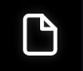

# Tiedostojen lisääminen projektiin

Kun olet luonut tai avannut projektin Chloros-ohjelmassa, seuraava vaihe on lisätä monispektrikuvat käsittelyn aloittamiseksi. Tiedostoselaimen -välilehden avulla on helppo tuoda kuvia ja hallita tietojoukkoasi.

## Tiedostoselaimen avaaminen

1. Avaa tai luo projekti Chloros-ohjelmassa
2. Napsauta **Tiedostoselain**  -kuvaketta vasemmassa sivupalkissa
3. Tiedostoselaimen paneeli näyttää projektisi tiedostoluettelon


**Tuetut tiedostotyypit**: Chloros tukee RAW+JPG- ja JPG-kuvatiedostoja, jotka on otettu MAPIR-, Survey3W- ja Survey3N-kameroilla. Suosittelemme käyttämään vain RAW+JPG-tiedostoja.


***

## Kuvien lisääminen projektiin

Kuvia voi lisätä projektiin kahdella tavalla:

### Tapa 1: Lisää tiedostoja

Käytä tätä vaihtoehtoa yksittäisten kuvatiedostojen tai pienen tiedostovalikoiman tuontiin.

1. Napsauta **&quot;Lisää tiedostoja&quot;**  -painiketta tiedostoselaimen paneelin yläosassa
2. Siirry kansioon, jossa kuvasi ovat
3. Valitse yksi tai useampi kuvatiedosto (pidä **Ctrl**-näppäintä painettuna valitaksesi useita tiedostoja)
4. Napsauta **&quot;Avaa&quot;** tuodaksesi valitut tiedostot

### Tapa 2: Lisää kansio

Käytä tätä vaihtoehtoa tuodaksesi kaikki kuvat kansiosta kerralla.

1. Napsauta **&quot;Lisää kansio&quot;**  -painiketta tiedostoselaimen paneelin yläosassa
2. Siirry kansioon, jossa kuvausistunnon kuvat sijaitsevat, ja valitse se
3. Napsauta **&quot;Valitse kansio&quot;** tuodaksesi kaikki tuetut kuvat kyseisestä kansiosta***

## Tiedostoselaimen taulukon ymmärtäminen

Kun kuvat on tuotu, ne näkyvät taulukossa, jossa on seuraavat sarakkeet:

### Tiedostonimi

* Kameran alkuperäinen tiedostonimi
* Säilyttää kameran nimeämiskäytännön (esim. IMG\_0001.RAW)

### Aikaleima

* Kuvan ottamispäivä ja -aika
* Otettu kuvan EXIF-metatiedoista
* Käytetään PPK-synkronointiin ja kalibrointikohteen tunnistamiseen

### Kameramalli

* Automaattisesti tunnistettu kamera- ja suodatinkonfiguraatio
* Esimerkkejä: Survey3W\_RGN, Survey3N\_OCN, Survey3W\_RGB
* Käytetään oikeiden käsittelyprofiilien soveltamiseen

### Kohdesarake (valintaruutu)

* Valitse tämä valintaruutu kuville, jotka sisältävät kalibrointikohteita
* Nopeuttaa huomattavasti kohteen tunnistusta käsittelyn aikana
* Katso lisätietoja kohdasta [Kohdekuvien valinta](choosing-target-images.md)

### Kuvan metatietojen tarkastelu

Napsauttamalla taulukon yläkulmassa oikealla olevaa kytkinpainiketta saat näkyviin valitun kuvan metatiedot kuvaruudukkoalueella.

<figure><figcaption></figcaption></figure>

***

## Tiedostojen hallinta projektissasi

### Tiedostojen poistaminen

Poistaaksesi tarpeettomat kuvat projektistasi:

1. Valitse yksi tai useampi kuva Tiedostoselaimen taulukosta
2. Napsauta **&quot;Poista valitut&quot;**  -painiketta
3. Vahvista poisto (tiedostoja ei poisteta levyltä, vaan ne poistetaan vain projektista)

### Lajittelu ja suodatus

* **Lajittele sarakkeen mukaan**: Napsauta mitä tahansa sarakkeen otsikkoa lajitellaksesi kuvat
* **Lajittele aikaleiman mukaan**: Hyödyllinen kronologisten kuvausjonojen järjestämiseen
* **Kameramallisuodatin**: Ryhmittele kuvat kameratyypin mukaan, jos käytät useita kameroita***

## Kuvan esikatselu

### Kuvan katselu kokonaan

Napsauta mitä tahansa kuvan pikkukuvaa tiedostoselaimessa, jotta se näkyy pääesikatselualueella:

1. Kuva näkyy keskellä olevassa esikatselupaneelissa
2. Tarkastele kuvan yksityiskohtia zoomauspainikkeilla
3. Siirry kuvien välillä nuolinäppäimillä

### Pikaselaus

* **Edellinen kuva**: Napsauta vasenta nuolta tai paina ←-näppäintä
* **Seuraava kuva**: Napsauta oikeaa nuolta tai paina →-näppäintä
* **Lähentäminen/loitontaminen**: Käytä hiiren rullaa tai zoomauspainikkeita
* **Panorointi**: Napsauta ja vedä kuvaa, kun se on suurennettuna***

## Tiedostojen kaksoiskappaleiden käsittely

Chloros tunnistaa ja ohittaa automaattisesti tiedostojen kaksoiskappaleet:

* Tiedostot, joiden nimet ovat identtiset, ohitetaan
* Estää tahattoman kaksinkertaisen käsittelyn
* Varoitusviesti näkyy, kun kaksoiskappaleita havaitaan


**Tärkeää**: Älä nimeä uudelleen tai muokkaa alkuperäisiä kuvatiedostoja ennen tuontia. Chloros käyttää alkuperäisiä tiedostonimiä ja metatietoja oikeanlaisen käsittelyn varmistamiseksi.


***

## Sekalaiset kameratiedostot

Jos projektisi sisältää kuvia useista MAPIR-kameroista:

1. Chloros tunnistaa automaattisesti kunkin kameramallin
2. Kukin kameratyyppi käsitellään sille sopivalla kalibrointiprofiililla
3. Tiedostoselaimessa näkyy kameramalli Kameramalli-sarakkeessa
4. Käsittelyssä käytetään oikeita asetuksia kullekin kameratyypille

**Esimerkki**: Survey3W RGN + Survey3N OCN kahden kameran kokoonpano***

## Parhaat käytännöt

### Järjestä ennen tuontia

* Säilytä kalibrointikohdekuvat samassa kansiossa kuin kartoituskuvat
* Säilytä kameran/SD-kortin alkuperäinen kansiorakenne
* Älä sekoita eri istunnoista peräisin olevia tietojoukkoja yhteen projektiin

### Tiedostojen nimeäminen

* Säilytä alkuperäiset kameratiedostojen nimet (IMG\_0001.RAW jne.)
* Älä nimeä tiedostoja uudelleen ennen tuontia
* Alkuperäiset nimet sisältävät tärkeitä metatietoja

### Kalibrointikohdekuvat

* Lisää aina 1–2 kalibrointikohdekuvaa per istunto
* Ota kuvat kohteista ennen ja jälkeen kuvausistunnon
* Aseta kohteet samoihin valaistusolosuhteisiin kuin kuvausalue
* Merkitse kohdekuvat Target-valintaruudulla käsittelyn nopeuttamiseksi

***

## Yleisiä ongelmia ja ratkaisuja

### Kuvat eivät näy tuonnin jälkeen

**Mahdolliset syyt:**

* Tiedostomuotoa ei tueta (vain RAW+JPG ja JPG MAPIR-kameroista)
* Kuvat ovat peräisin muista kuin MAPIR-kameroista (katso [Tuetut kamerat](../supported-cameras.md))
* Tiedosto on vioittunut tai siirto SD-kortilta on jäänyt kesken

**Ratkaisu**: Tarkista tiedostomuodon ja kameramallin yhteensopivuus

### Kameramallia ei tunnistettu

**Mahdolliset syyt:**

* Muokatut EXIF-metatiedot
* Kuvat on muokattu ulkoisella ohjelmistolla
* Tiedostojen siirto on jäänyt kesken

**Ratkaisu**: Tuo alkuperäiset, muokkaamattomat tiedostot uudelleen kamerasta/SD-kortilta

### Puuttuvat aikaleimat

**Mahdolliset syyt:**

* Kameran kello ei ole asetettu oikein
* EXIF-tiedot on poistettu ulkoisella ohjelmistolla

**Ratkaisu**: Varmista, että kameran aika-asetukset olivat oikeat kuvauksen aikana***

## Seuraavat vaiheet

Kun tiedostosi on tuotu:

1. **Tarkista tiedostoluettelo** – Varmista, että kaikki kuvat on ladattu oikein
2. **Tarkista kameramallit** – Varmista, että kamera on tunnistettu oikein
3. **Merkitse kohdekuvat** – Katso [Kohdekuvien valinta](choosing-target-images.md)
4. **Säädä asetuksia** – Määritä käsittelyasetukset kohdassa [Projektin asetukset](adjusting-project-settings.md)
5. **Käynnistä käsittely** – Katso [Käsittelyn käynnistäminen](starting-the-processing.md)

Yksityiskohtaisia tietoja projektin määrittämisestä on kohdassa [Projektin asetusten säätäminen](adjusting-project-settings.md).
